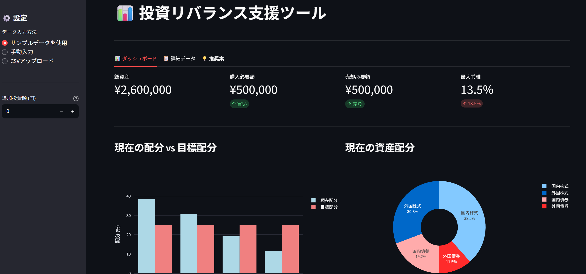

# 投資リバランス支援ツール 📊

ポートフォリオの目標配分からのズレを計算し、リバランス案を提示するツール

## 🌟 機能

- ポートフォリオの現在配分を自動計算
- 目標配分との乖離を可視化
- リバランス必要額を算出
- 売買推奨案を表示
- 追加投資を含めた最適配分計算

## 🖼️ スクリーンショット

### ダッシュボード


### リバランス推奨案


## 🚀 使い方

### CLI版
```bash
python main.py
```

### Web版
```bash
streamlit run app.py
```

ブラウザで http://localhost:8501 が開きます

## 📊 データ形式

`data/sample_portfolio.csv`:
```csv
資産クラス,現在額,目標配分
国内株式,1000000,25
外国株式,800000,25
国内債券,500000,25
外国債券,300000,25
```

## 💡 使用例

### ケース1: 定期リバランス

月末にポートフォリオをチェックし、5%以上乖離している資産クラスを調整

### ケース2: 追加投資

ボーナス時など、追加投資額を入力して最適な購入配分を確認

## 🛠️ 技術スタック

- Python 3.11
- Pandas: データ処理
- Streamlit: Webアプリ
- Plotly: インタラクティブグラフ

## 📁 プロジェクト構造
```
portfolio-rebalancer/
├── README.md
├── requirements.txt
├── main.py              # CLI版
├── app.py              # Web版
├── data/
│   └── sample_portfolio.csv
├── src/
│   ├── calculator.py   # 計算ロジック
│   └── stock_price.py  # 株価取得(オプション)
└── images/
    └── webapp_*.png
```

## 🔮 今後の予定

- [ ] 株価自動取得(yfinance連携)
- [ ] リスク指標表示
- [ ] 履歴管理機能
- [ ] PDF レポート出力

## 👤 作成者

- GitHub: [@your-username](https://github.com/your-username)

## 📝 ライセンス

MIT License